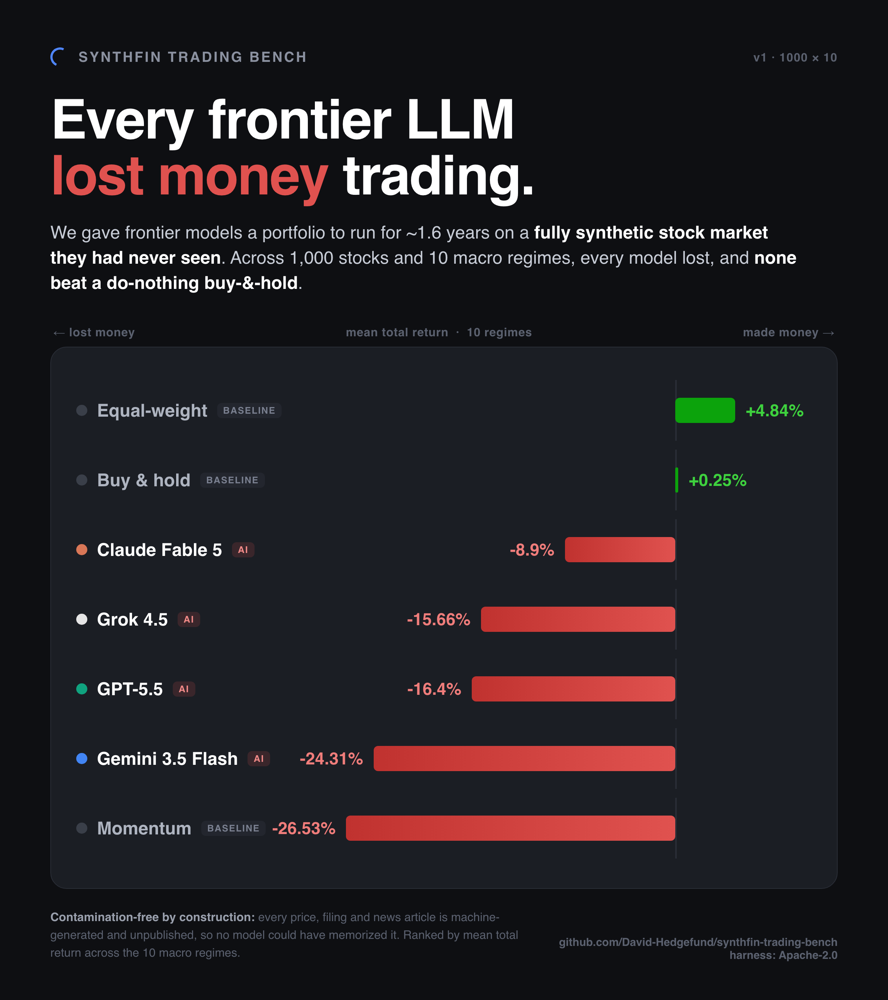

# SynthFin Trading Bench

**A contamination-free sequential trading benchmark for LLM agents.**



> On the published 1000x10 benchmark, every frontier LLM we tested lost money and none beat a
> do-nothing buy-and-hold. See the [leaderboard](docs/LEADERBOARD.md).

SynthFin Trading Bench evaluates a language model as a portfolio manager. Each period the model
receives a strictly point-in-time view of a market - prices, fundamentals, news, and filings all
dated on or before the decision day - and outputs a target portfolio. Orders fill at the next
session's open and pay transaction costs. Over a multi-year scenario the model makes a sequence
of decisions, and we score the resulting book on risk-adjusted return and stock-selection skill.

The market is **fully synthetic**. Every price path, fundamental, and news article is generated by
the SynthFin generation engine and has never been published,
so no model can have memorized it. That makes the benchmark **contamination-free by construction** -
the single hardest property for a real-market trading benchmark to guarantee.

> **Status:** harness validated end-to-end on the bundled 50×10 corpus. The published benchmark
> runs on **1000 tickers × 10 macro scenarios** (see [`docs/DATA_CARD.md`](docs/DATA_CARD.md)).

**Website / leaderboard:** the public leaderboard site lives in [`site/`](site/) and is generated
from the results (`python scripts/build_site.py --run <run>`), then deployed to GitHub Pages by
[`.github/workflows/pages.yml`](.github/workflows/pages.yml) on every push to `main`. To enable it
once: repo **Settings → Pages → Source: GitHub Actions**.

---

## Why another trading benchmark?

| Property | Real-market benchmarks (e.g. StockBench) | SynthFin Trading Bench |
|---|---|---|
| Training-data contamination | Mitigated by using *future* data; degrades over time | **Impossible** - data is synthetic and unpublished |
| Ground-truth skill signal | Inferred by regression | Realized + a labeled generator decomposition |
| Scenario coverage | Whatever the market did | **Curated regimes**: AI-bubble pop, GFC replay, COVID, Taiwan blockade, soft landing, … |
| Reproducibility | Data revisions, survivorship | Frozen corpus with a content hash; deterministic replay |
| Refresh | Wait for new market history | Generate a new unseen corpus on demand |

## How it works

```
                 point-in-time observation                target portfolio
   corpus  ──▶  (prices ≤ t, news ≤ t,      ──▶  agent  ──▶  {weights}  ──▶  execute at t+1 open
                 fundamentals ≤ t, holdings)                                 (turnover × cost_bps)
                                                                                   │
   repeat every `rebalance_every_days` ◀──────────────────────────────────────────┘
                                                                                   │
                                            NAV series + trajectory  ──▶  scoring  ──▶  leaderboard
```

- **Every data source, point-in-time.** Each decision the agent sees prices & trailing returns,
  quarterly financials (10-Q income statement + balance sheet), earnings surprises, **analyst
  estimates** (consensus target, rating mix, revisions), guidance, **13F institutional holdings and
  insider trades** (when the corpus carries them), and the news/filing/transcript **text** - each
  gated by its own availability date. Deep data is focused on holdings + momentum candidates; the
  compact universe table spans all names for screening. Full table in [`docs/METHODOLOGY.md`](docs/METHODOLOGY.md).
- **No lookahead.** Documents gated by `date`, financials by `filing_date`, execution one bar after
  the decision. The end-of-scenario `metrics_ttm` snapshot is deliberately *not* used - TTM is
  recomputed from filed 10-Qs. Enforced in code and covered by tests.
- **Split-safe accounting.** All P&L is in split-adjusted price space, so corporate actions never
  distort share counts.
- **Skill, not luck.** The headline metric is the **appraisal ratio** (annualized alpha ÷
  idiosyncratic vol) from a CAPM regression of the book's realized returns on the market proxy -
  the standard measure of selection skill net of market beta. A supplementary *generator
  attribution* breaks returns into the DGP's labeled drivers (see
  [`docs/METHODOLOGY.md`](docs/METHODOLOGY.md)).

## Quickstart

```bash
pip install -e ".[dev]"                 # core; add [anthropic]/[openai]/[gemini]/[all] for models

# 1) Free, API-less smoke test: mock LLM + baselines on the bundled 50×10 corpus
python -m bench.runner configs/validation_50x10.yaml --run-id smoke

# 2) Real models (needs ANTHROPIC_API_KEY / OPENAI_API_KEY / GEMINI_API_KEY / XAI_API_KEY)
python -m bench.runner configs/default.yaml --run-id demo

# 3) The published benchmark (after provisioning the 1000×10 corpus)
python -m bench.runner configs/full_1000x10.yaml --run-id v1

# Rebuild a leaderboard from saved scores
python -m bench.leaderboard results/v1
```

Every run writes `results/<run_id>/` with `run_meta.json` (config + corpus hash), per-scenario
`trajectories/` and `scores/`, and `leaderboard.{json,md}`.

## Published leaderboard (1000×10, v1)

| # | Agent | Mean Ret | Sharpe | Alpha (ann) | Appraisal | Beta |
|---|---|---|---|---|---|---|
| 1 | baseline_ew_rebal | +4.84% | +0.28 | +0.12% | +0.14 | +0.99 |
| 2 | baseline_buyhold | +0.25% | +0.10 | -2.41% | -4.51 | +0.99 |
| 3 | claude-fable-5 | -8.90% | -0.36 | -8.07% | -1.08 | +0.97 |
| 4 | grok-4.5 | -15.66% | -0.59 | -12.96% | -1.64 | +0.96 |
| 5 | gpt-5.5 | -16.40% | -0.64 | -13.58% | -1.81 | +0.94 |
| 6 | gemini-3.5-flash | -24.31% | -0.97 | -18.83% | -2.62 | +0.98 |
| 7 | baseline_momentum | -26.53% | -1.12 | -20.79% | -4.83 | +1.02 |

*Every frontier LLM posted a negative return and negative alpha, and none beat buy-and-hold. Full metrics (Sortino, MaxDD, win rate, turnover) in [`docs/LEADERBOARD.md`](docs/LEADERBOARD.md). The free, API-less smoke test (baselines + `mock_llm` on the bundled 50×10 corpus) is in the quickstart above.*

## Repository layout

```
bench/            the harness (importable, no side effects on import)
  corpus.py         format-tolerant loader + point-in-time views + content hashing
  observation.py    builds the point-in-time observation for each decision
  simulator.py      portfolio engine: next-open execution, costs, accounting
  scoring.py        performance + CAPM skill metrics + generator attribution
  agents/           provider adapters (anthropic/openai/gemini/xai) + baselines + mock
  runner.py         orchestration; leaderboard.py: aggregation/rendering
configs/          validation_50x10 · default · full_1000x10
docs/             METHODOLOGY · DATA_CARD · CONTAMINATION · PUBLISHING
scripts/          hash_corpus.py · make_subset.py · build_site.py · upload_to_hf.py
tests/            invariant tests (no-lookahead, accounting, attribution, CAPM)
```

## Extending

- **New model provider:** subclass `bench.agents.llm.LLMAgent`, implement `_client_init` and
  `_complete`, and register it in `bench/agents/__init__.py`. All providers share one prompt.
- **New baseline:** add a strategy in `bench/agents/baselines.py`.
- **New corpus:** any SynthFin export (an `index.json` + `structured/` + `unstructured/`) works
  unchanged - point `corpus_path` at it.

## License

Code: Apache-2.0 (see [LICENSE](LICENSE)). The corpus is released separately under the terms in
[`docs/DATA_CARD.md`](docs/DATA_CARD.md).
